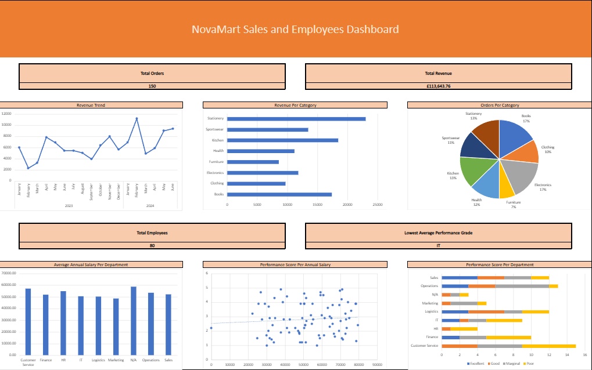

# NovaMart Project Overview

An Excel data analysis project for a fictional business, dealing with both their sales and their employees. The dataset contains four worksheets containing raw data, as well as an additional four worksheets with reference tables.

## Features

- Cleaning raw data
  - Removed duplicate values.
  - Trimmed spaces.
  - Filled blank cells.
  - Standardised the yes/no column.
  - Standardised capitalisation for consistency.
  - Standardised the numbers on the salary column.
  - Standardised mixed date formats.
  - Standardised department names.

- Using Excel formulas
  - Used basic formulas such as SUM and COUNT.
  - Applied conditional formatting.
  - Used IFS for logical operations.
  - Mastered TEXT functions (e.g., TRIM, PROPER, CONCATENATE).
  - Utilised DATE functions such as DAYS.
  - Used VLOOKUP for data retrieval.
  - Used XLOOKUP for data retrieval, including using XLOOKUP to return multiple rows and to retrieve horizontally-aligned tables.

- Analysing the data
  - Created and managed PivotTables to summarise the data.
  - Use slicers for interactive filtering in PivotTables.
  - Generated charts and graphs to visualise the data.

## Dataset

- Four raw data sheets
  - Orders. This sheet contains the following information regarding orders: the customer IDs, product IDs, names of the product purchased, price of the product, order date, delivery date, region where the customer ordered the product(s) from, status of the order, name of the sales representative, and any notes for the delivery driver.
  - Employees. This sheet contains the following information regarding the employees of NovaMart: the employee IDs, full names of each employee, the department of each employee, the hire date of each employee, the annual salary of each employee, their performance scores, their emails, their contract types, and the region of the UK that they work in.
  - Products. This sheet contains the following information regarding the products sold by NovaMart: the product IDs, the product names, category of the products, stock level, the reorder level which is a minimum stock level that triggers a reorder level, and an active column which tells us whether or not a particular item is still up for sale.
  - Returns. This sheet contains the following information regarding returns: the return IDs, product IDs, return dates, reasons given for the return, refund amounts, whether or not the returns have been resolved or not, and how many days it took to resolve.

- Four reference sheets
  - Regions. This sheet contains information regarding sales targets and whether or not a particular region is currently active and trading.
  - Products. This sheet contains information regarding the product categories, individual price, supplier, minimum order quantity for the suppliers to deliver to NovaMart, and how many days it takes for a supplier to deliver stock after an order is placed.
  - Employees. This sheet contains information regarding the departments each employee works in, their job grade, manager, and office location.
  - Price bands. This sheet contains information regarding the boundaries of each price band, how much discount each band gets, and whether or not they are eligible for free delivery.

## What I learnt

Throughout this project, I learnt the essentials of data analysis using excel such as how to clean data, create formulas to understand the data better, and visualise the data by using pivot tables, making charts, using conditional formatting, and creating a dashboard to summarise it.

## Dashboard

